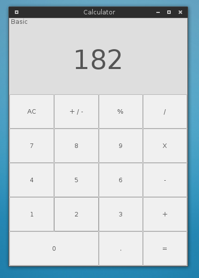

# Calculator

## Introduction

This is a simple implementation of basic calculator, which is wrote by C and GTK library. the inspiration comes from the calculator in iPhone. The project is built with Anjuta, which is a open source software for gnome.

## Screenshot

Distribution: Arch Linux

Desktop Environment: Xfce 4.12

Gnome Theme: Numix



## Requirement

* GTK 3

## Compile and Run

``` sh
# Configure the project.
./configure

# Compile and build project.
make

# Run the programming after that.
./src/calculator
```

## Not about programming

Thank for browsing. The software is open source and free. Just enjoy it.
